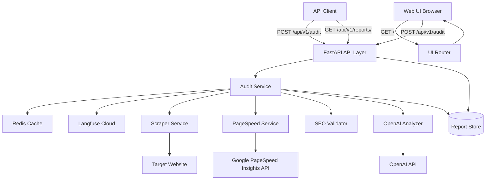
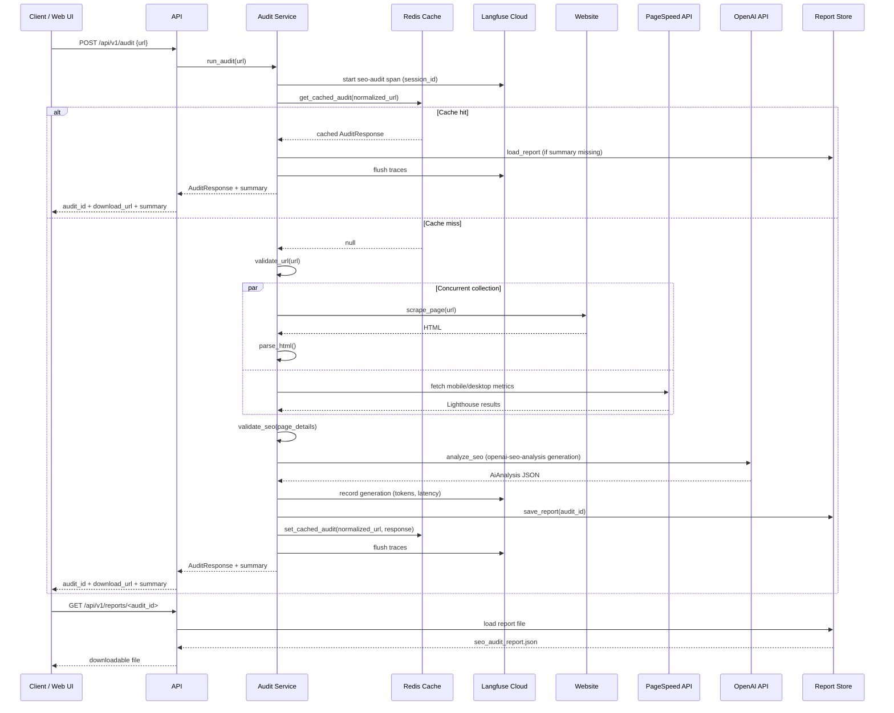
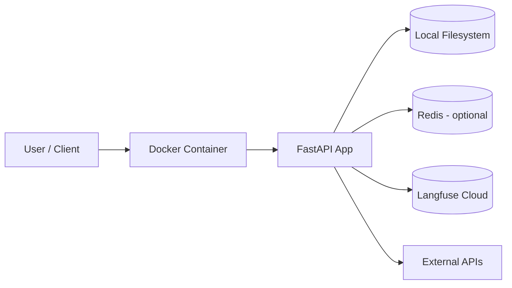
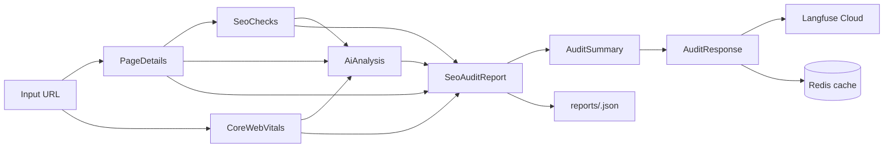

# Architecture Diagram — SEO Insight AI

## Component Diagram

## Audit Sequence

## Deployment Diagram

## Data Flow

## API Surface

| Method | Path | Description |
|--------|------|-------------|
| `GET` | `/` | Web UI (audit form + summary dashboard) |
| `GET` | `/api/v1/health/` | Health check |
| `POST` | `/api/v1/audit` | Run SEO audit |
| `GET` | `/api/v1/reports/{audit_id}` | Download full JSON report |
