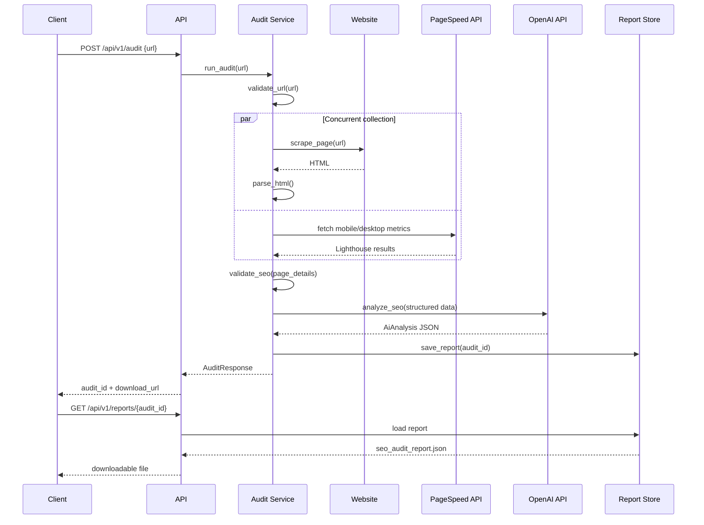
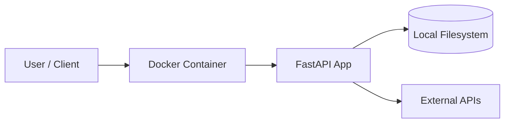
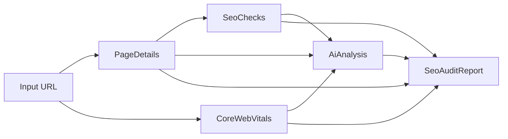

# Architecture Diagram — SEO Insight AI

## Component Diagram

```mermaid
flowchart TB
    Client[API Client]
    API[FastAPI API Layer]
    Audit[Audit Service]
    Scraper[Scraper Service]
    SEO[SEO Validator]
    PSI[PageSpeed Service]
    AI[OpenAI Analyzer]
  Reports[(Report Store)]
    Site[Target Website]
    Google[Google PageSpeed Insights API]
    OpenAI[OpenAI API]

    Client -->|POST /api/v1/audit| API
    Client -->|GET /api/v1/reports/{audit_id}| API
    API --> Audit
    Audit --> Scraper
    Audit --> PSI
    Audit --> SEO
    Audit --> AI
    Scraper --> Site
    PSI --> Google
    AI --> OpenAI
    Audit --> Reports
    API --> Reports
```

## Audit Sequence



## Deployment Diagram



## Data Flow


